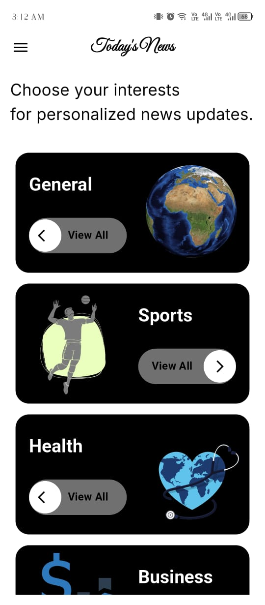
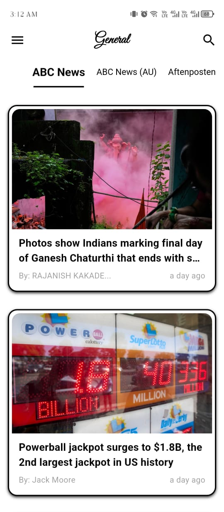
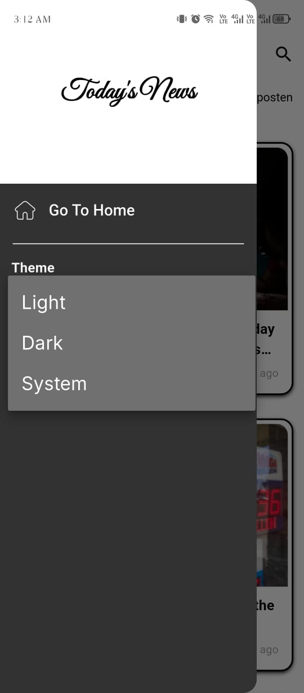
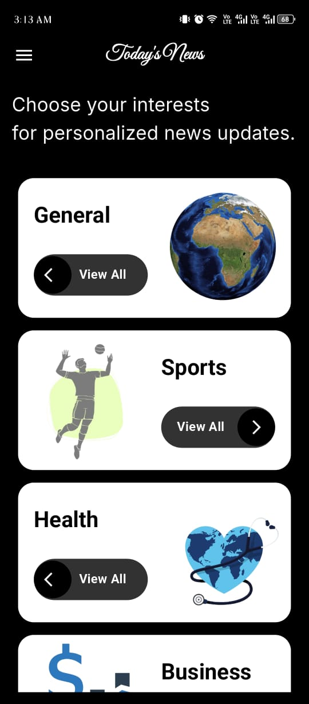
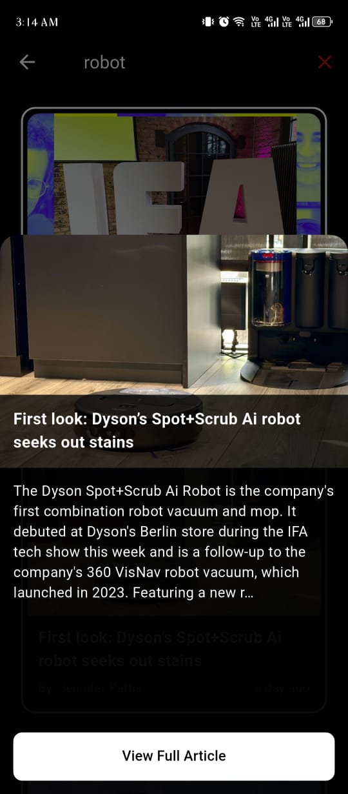

# 🌐 ToDay's News - News App

## 📋 Overview
ToDay's News is a modern news application built with Flutter, designed to provide users with a seamless experience to browse the latest news across various categories. The app supports multiple features like advanced search, dark/light mode, and smooth UI animations, making it a versatile tool for staying updated.

## 🚀 Features
- 📰 **News Categories & Sources**: Browse news by categories (Sports, Technology, Health, …).
- 📑 **Articles Listing with Pagination**: Load articles gradually with infinite scroll support.
- ✨ **Shimmer Loading & Animated States**: Smooth interface during loading or errors.
- 🔍 **Advanced Search with Debouncing**: Quick and efficient search with performance optimization.
- 🌙 **Dark & Light Mode**: Customize user experience with SharedPreferences for settings storage.
- 🌐 **News Details in WebView**: Read news directly within the app.
- 🔄 **Error & Retry Handling**: Display error messages with retry options.
- 🗂 **Drawer Navigation**: Easily navigate between sections and the home screen.
- 🎨 **Consistent UI & Theming**: Responsive design with flutter_screenutil support.

## 🛠 Tech Stack & Packages

### Architecture & State Management
- 🏗 **Bloc / Cubit**: Organized state management.
- 📐 **MVVM Architecture**: Clean and scalable code structure.
- 💉 **Injectable + GetIt**: Dependency Injection for code dependencies.

### Networking
- 🌍 **Dio**: Fetch news and handle API requests.

### UI & UX
- 🎨 **Shimmer**: Display loading placeholders.
- 🌙 **SharedPreferences**: Save theme mode (Dark / Light).
- 📱 **Flutter ScreenUtil**: Responsive UI design for all screens.
- 🌐 **WebView_flutter**: Open news details inside the app.

### Core
- ⚡ **Equatable**: Efficient object comparison.
- 📦 **Dartz**: Handle Either (Success / Failure) with functional programming.

## 📂 Project Structure
Below is the organized structure of the project files:

```plaintext
lib/
│── core/
│   ├── 📁 DI/               # Dependency Injection
│   ├── 📁 remote/           # API Manager & Endpoints
│   ├── 📁 resources/        # Styles, Themes, Constants
│── features/
│   ├── 📁 home_screen/      # Home & Categories UI
│   ├── 📁 category_details/ # Sources, Articles, Search
│   ├── 📁 splash_screen/    # Splash Screen
│── 📄 main.dart

```

## 📸 Screenshots

<table>
  <tr>
    <td></td>
    <td></td>
    <td></td>
    <td></td>
    <td></td>
    <td></td>
  </tr>
</table>

## 🏁 Getting Started
Clone the repository:
```bash
git clone https://github.com/your-username/news_app.git
cd news_app
```
Install dependencies:
```bash
flutter pub get
```
Run the app:
```bash
flutter run
```
